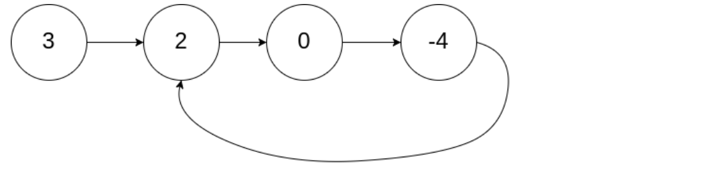

# 环形链表 II
<a href="https://leetcode-cn.com/problems/linked-list-cycle-ii/" target="_blank">题目链接</a>

<div>给定一个链表，返回链表开始入环的第一个节点。 如果链表无环，则返回 null。
如果链表中有某个节点，可以通过连续跟踪 next 指针再次到达，则链表中存在环。 为了表示给定链表中的环，
评测系统内部使用整数 pos 来表示链表尾连接到链表中的位置（索引从 0 开始）。如果 pos 是 -1，则在该链表中没有环。注意：pos 不作为参数进行传递，仅仅是为了标识链表的实际情况。
不允许修改 链表。</div>
<div> </div>
```
输入：head = [3,2,0,-4], pos = 1
输出：返回索引为 1 的链表节点
解释：链表中有一个环，其尾部连接到第二个节点。
```

> 思路:利用快慢指针先找到链表第一次相交的地方，然后移动其中一个指针到头节点，每次都走一步下一次相交的地方就是其环的连接点
x = nz  

- 快慢指针
```js
var detectCycle = function (head) {
    if (!head) return null
    let p = head;
    let p1 = head;

    while (p1 && p1.next) {
        let val = p.next;
        let val1 = p1.next.next
        if (val === val1) {
            val = head;
            while (val1 !== val) {
                val = val.next;
                val1 = val1.next
            }
            return val
        }
        p = p.next;
        p1 = p1.next.next
    }
    return null
};
```

- 记忆法
 ```js
var detectCycle = function (head) {
    if (!head) return null;
    let s = new Set();
    let p = head;
    while (p) {
        if (s.has(p)) {
            return p;
        }
        s.add(p);
        p = p.next;


    }
    return null

};
```