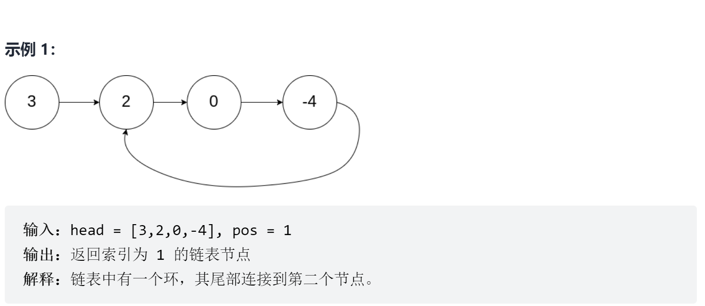

# 环形链表 II
<a href="https://leetcode-cn.com/problems/linked-list-cycle-ii/" target="_blank">题目链接</a>

给定一个链表，返回链表开始入环的第一个节点。 如果链表无环，则返回 null。

如果链表中有某个节点，可以通过连续跟踪 next 指针再次到达，则链表中存在环。 为了表示给定链表中的环，评测系统内部使用整数 pos 来表示链表尾连接到链表中的位置（索引从 0 开始）。如果 pos 是 -1，则在该链表中没有环。注意：pos 不作为参数进行传递，仅仅是为了标识链表的实际情况。


<div> </div>


> 第一种思路是相交之后将一个指针指向头然后同时移动第一次相交就是入口

```js
var detectCycle = function (head) {
    if (!(head && head.next)) return null
    let p = head
    let p1 = head

    while (p1 && p1.next) {
        let val1 = p.next
        let val2 = p1.next.next
        if (val1 == val2) {
            val1 = head
            while (val1 !== val2) {
                val1 = val1.next
                val2 = val2.next
            }
            return val1
        }
        p = p.next
        p1 = p1.next.next
    }
    return null
};
```


> 先找到第一次相交的点，然后将其中一个点再走一圈，计算他的环长度。然后两个节点快的先走环的长度然后一起走，相交的就是入口，因为快的已经走了一个环的长度了，再走x步就是他入口处，因为x+环的长度他会回到环的入口，这个x就是两个指针相交的地方

```js


```