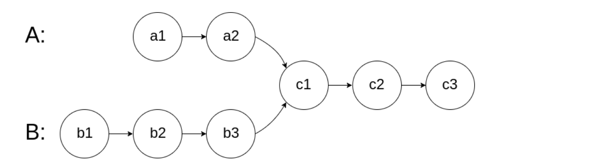

# 链表相交
<a href="https://leetcode-cn.com/problems/intersection-of-two-linked-lists-lcci/" target="_blank">题目链接</a>

给你两个单链表的头节点 headA 和 headB ，请你找出并返回两个单链表相交的起始节点。如果两个链表没有交点，返回 null 。
图示两个链表在节点 c1 开始相交：


<div> </div>


> 只要求出两个链表的长度的差值，长的先走差值的步数，然后一起走第一个相等的就是其相交的点

```js
var getIntersectionNode = function (headA, headB) {
    let p = headA
    let p1 = headB
    let p2 = headA
    let p3 = headB
    let count = 0, count1 = 0;
    while (p) {
        count++
        p = p.next
    }
    while (p1) {
        count1++
        p1 = p1.next
    }
    if (count > count1) {
        let dept = count - count1
        while (dept--) {
            p2 = p2.next
        }
        while (p2) {
            if (p2 === p3) return p2
            p2 = p2.next
            p3 = p3.next
        }
    } else if (count === count1) {
        while (p2) {
            if (p2 === p3) return p2
            p2 = p2.next
            p3 = p3.next
        }
    } else {
        let dept = count1 - count
        while (dept--) {
            p3 = p3.next
        }
        while (p2) {
            if (p2 === p3) return p2
            p2 = p2.next
            p3 = p3.next
        }
    }
    return null
};
```