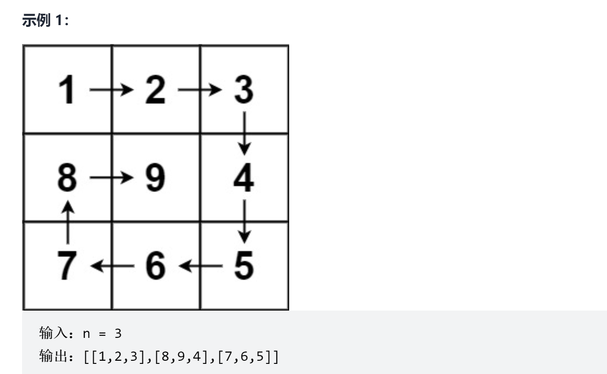

# 螺旋矩阵

<a href="https://leetcode-cn.com/problems/spiral-matrix-ii/" target="_blank">题目链接</a>

```
给你一个正整数 n ，生成一个包含 1 到 n2 所有元素，
且元素按顺时针顺序螺旋排列的 n x n 正方形矩阵 matrix 。
```
<div> </div>


> 思路：找到边界条件依次循环

```js
var generateMatrix = function (n) {
    const result = new Array(n).fill(0).map(() => new Array(n).fill(0))
    const sum = n * n;
    let x = 0, y = 0, index = 2;
    result[0][0]=1
    while (index <= sum) {
        //从左到右
        for (let i = y+1; i < n; i++) {
            if (result[x][i] > 0) break;
            result[x][i] = index;
            index += 1
            y = i
        }

        //从上到下
        for (let k = x + 1; k < n; k++) {
            if (result[k][y] > 0) break;
            result[k][y] = index
            index += 1
            x = k
        }

        //从右往左
        for (let f = y - 1; f >= 0; f--) {
            if (result[x][f] > 0) break;
            result[x][f] = index
            index += 1
            y = f
        }

        //从下到上
        for (let j = x-1; j >= 0; j--) {
            if (result[j][y] > 0) break;
            result[j][y] = index
            index += 1
            x = j
        }
    }
    return result
};
```