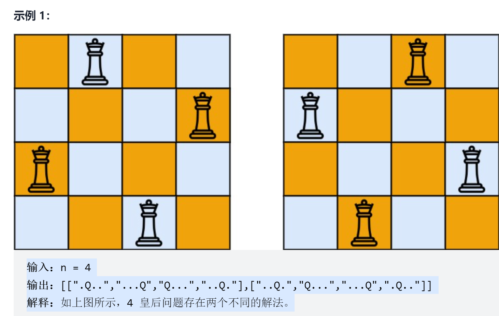

# N皇后
<a href="https://leetcode-cn.com/problems/n-queens/" target="_blank">题目链接</a>

<div> </div>

```
n 皇后问题 研究的是如何将 n 个皇后放置在 n×n 的棋盘上，并且使皇后彼此之间不能相互攻击。

给你一个整数 n ，返回所有不同的 n 皇后问题 的解决方案。

每一种解法包含一个不同的 n 皇后问题 的棋子放置方案，该方案中 'Q' 和 '.' 分别代表了皇后和空位

输入：n = 4
输出：[[".Q..","...Q","Q...","..Q."],["..Q.","Q...","...Q",".Q.."]]
解释：如上图所示，4 皇后问题存在两个不同的解法。

```


> 思路: 穷举回溯，创建一个数组来代表选取过的元素

```js

var solveNQueens = function (n) {
    const result = []
    const qp = new Array(n).fill(0).map(_ => new Array(n).fill('.'))//创建n*n的棋盘

    const checkIs = (start, index) => {
        for (let i = 0; i < n; i++) {//竖轴检测
            if (i === start) continue
            if (qp[i][index] === 'Q') return false
        }
        //交叉线检测
        let x = start
        let x1 = start
        let x2 = start
        let x3 = start
        let y = index
        let y1 = index
        let y2 = index
        let y3 = index
        while (++x < n && ++y < n) {
            if (qp[x][y] === 'Q') return false
        }
        while (--x1 >= 0 && --y1 >= 0) {
            if (qp[x1][y1] === 'Q') return false
        }
        while (--x2 >= 0 && ++y2 < n) {
            if (qp[x2][y2] === 'Q') return false
        }
        while ( ++x3 < n && --y3 >= 0) {
            if (qp[x3][y3] === 'Q') return false
        }
        return true
    }
    const backTrack = (start, arr) => {
        if (arr.length === n) {
            result.push(arr.slice())
            return
        }
        if (start >= n) return
        for (let i = 0; i < n; i++) {

            qp[start][i] = 'Q'
            if (!checkIs(start, i)) {
                qp[start][i] = '.'
                continue
            }
            arr.push(qp[start].join(''))
            backTrack(start + 1, arr)
            qp[start][i] = '.'
            arr.pop()
        }
    }
    backTrack(0, [])
    return result
};

```
