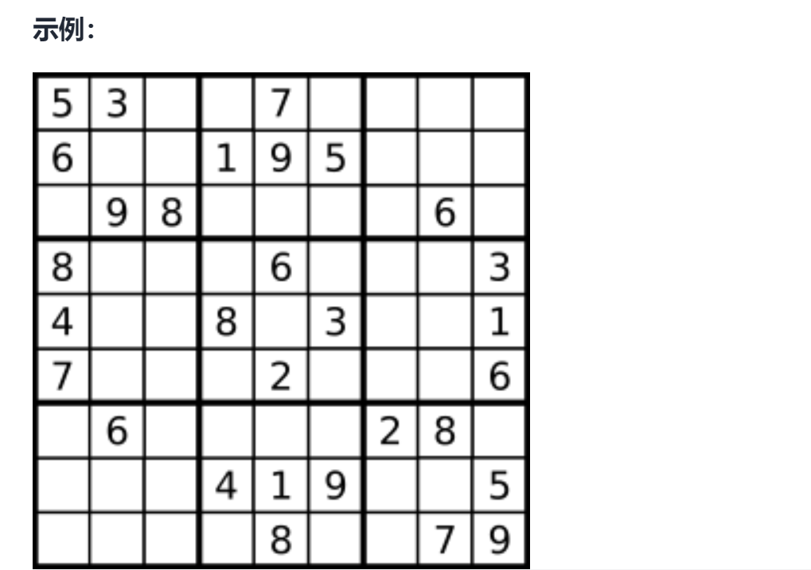

# 解数独
<a href="https://leetcode-cn.com/problems/sudoku-solver/" target="_blank">题目链接</a>

<div> </div>

```
编写一个程序，通过填充空格来解决数独问题。

数独的解法需 遵循如下规则：

数字 1-9 在每一行只能出现一次。
数字 1-9 在每一列只能出现一次。
数字 1-9 在每一个以粗实线分隔的 3x3 宫内只能出现一次。（请参考示例图）
数独部分空格内已填入了数字，空白格用 '.' 表示。

输入：board = [["5","3",".",".","7",".",".",".","."],["6",".",".","1","9","5",".",".","."],
[".","9","8",".",".",".",".","6","."],["8",".",".",".","6",".",".",".","3"],
["4",".",".","8",".","3",".",".","1"],["7",".",".",".","2",".",".",".","6"],
[".","6",".",".",".",".","2","8","."],[".",".",".","4","1","9",".",".","5"],
[".",".",".",".","8",".",".","7","9"]]
输出：[["5","3","4","6","7","8","9","1","2"],["6","7","2","1","9","5","3","4","8"],
["1","9","8","3","4","2","5","6","7"],["8","5","9","7","6","1","4","2","3"],
["4","2","6","8","5","3","7","9","1"],["7","1","3","9","2","4","8","5","6"],
["9","6","1","5","3","7","2","8","4"],["2","8","7","4","1","9","6","3","5"],
["3","4","5","2","8","6","1","7","9"]]


```


> 思路: 穷举回溯，每种选择都判断是否满足即可

```js

var solveSudoku = function (board) {


    const isRight = (start, index, number) => {
        //行
        let h = 0, l = 0;
        while (h < 9) {
            if (Number(board[start][h]) === number) return false
            h++
        }
        //列
        while (l < 9) {
            if (Number(board[l][index]) === number) return false
            l++
        }
        //九宫格
        //返回九宫格顶点坐标，遍历所有元素
        let start1 = (start + 1) / 3
        let index1 = (index + 1) / 3

        if (index1 <= 1) {
            index1 = 0
        } else if (index1 > 1 && index1 <= 2) {
            index1 = 3
        } else if (index1 > 2 && index1 <= 3) {
            index1 = 6
        }
        if (start1 <= 1) {
            start1 = 0
        } else if (start1 > 1 && start1 <= 2) {
            start1 = 3
        } else if (start1 > 2 && start1 <= 3) {
            start1 = 6
        }
        for (let i = start1; i < start1 + 3; i++) {
            for (let k = index1; k < index1 + 3; k++) {
                if (Number(board[i][k])  === number) return false
            }
        }
        return true
    }
    const backTrack = (x, y) => {
        if (y === 9) {
            x++
            y = 0
            if (x === 9) return true
        }
        if (board[x][y] !== '.') {
            return backTrack(x, y + 1)
        }

        for (let i = 1; i <= 9; i++) {
            if (isRight(x, y, i)) {
                board[x][y] = i.toString()//选取
                if (backTrack(x, y + 1)) return true
                board[x][y] = '.'//选取
            }

        }
        return false

    }

    backTrack(0, 0)

return board


};

```
