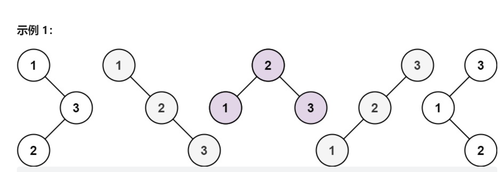

# 不同的二叉搜索树
<a href="https://leetcode-cn.com/problems/integer-break/" target="_blank">题目链接</a>

<div> </div>

```
给你一个整数 n ，求恰由 n 个节点组成且节点值从 1 到 n 互不相同的 二叉搜索树 有多少种？
返回满足题意的二叉搜索树的种数

```


```js
function numTrees(n: number): number {

    //找出规律，当节点数为 n 组合数=左边节点的组合*右边节点的组合
    const dp = new Array(n+1).fill(0)
    dp[0] = 1

    for (let i = 1; i <= n; i++) {

        for (let k = 0; k < i; k++) {
            dp[i] = dp[i] +(dp[k] * dp[i - k - 1]) 
        }
    }
    return dp[n]
};
```
