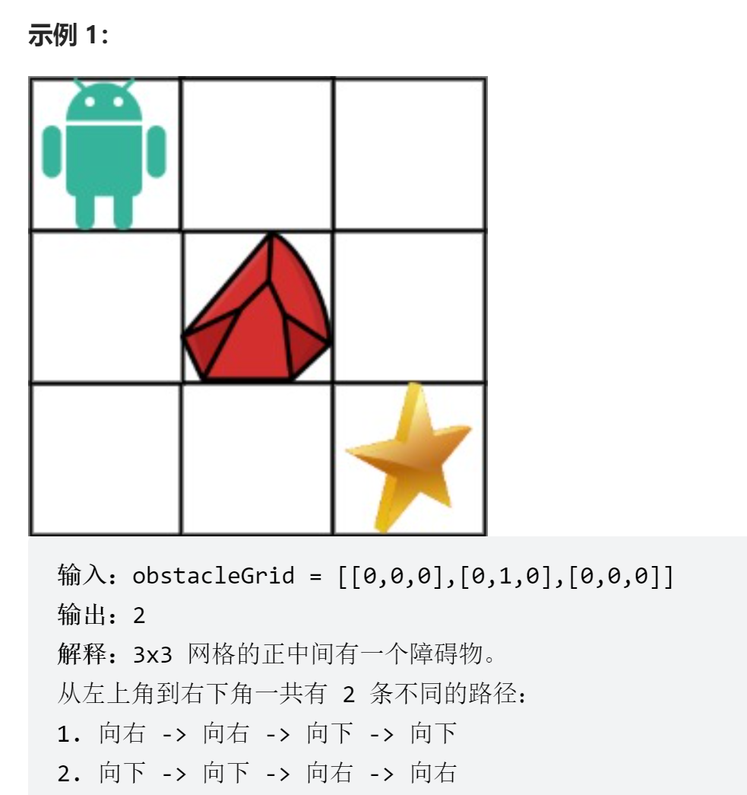

# 不同路径 II
<a href="https://leetcode-cn.com/problems/unique-paths-ii/" target="_blank">题目链接</a>

<div> </div>


```
一个机器人位于一个 m x n 网格的左上角 （起始点在下图中标记为 “Start” ）。

机器人每次只能向下或者向右移动一步。机器人试图达到网格的右下角（在下图中标记为 “Finish”）。

现在考虑网格中有障碍物。那么从左上角到右下角将会有多少条不同的路径？

网格中的障碍物和空位置分别用 1 和 0 来表示。

```

- 穷举容易想到动态规划，basecase为obstacleGrid的第一项是否为障碍物如果不是arr[0][0]=1，
- 状态转移方程为 arr[i][k] = arr[i - 1][k] + arr[i][k - 1]

```js
var uniquePathsWithObstacles = function (obstacleGrid) {
    const m = obstacleGrid.length;
    const n = obstacleGrid[0].length
    const arr = new Array(m).fill(0).map(() => new Array(n).fill(0));

    for (let i = 0; i < m; i++) {
        if (obstacleGrid[i][0] === 1) break;
        arr[i][0] = 1
    }

    for (let i = 0; i < n; i++) {
        if (obstacleGrid[0][i] === 1) break;
        arr[0][i] = 1
    }

    for (let i = 1; i < m; i++) {
        for (let k = 1; k < n; k++) {
            if (obstacleGrid[i][k] === 1) continue
            arr[i][k] = arr[i - 1][k] + arr[i][k - 1]
        }
    }

return arr[m-1][n-1]


};
```