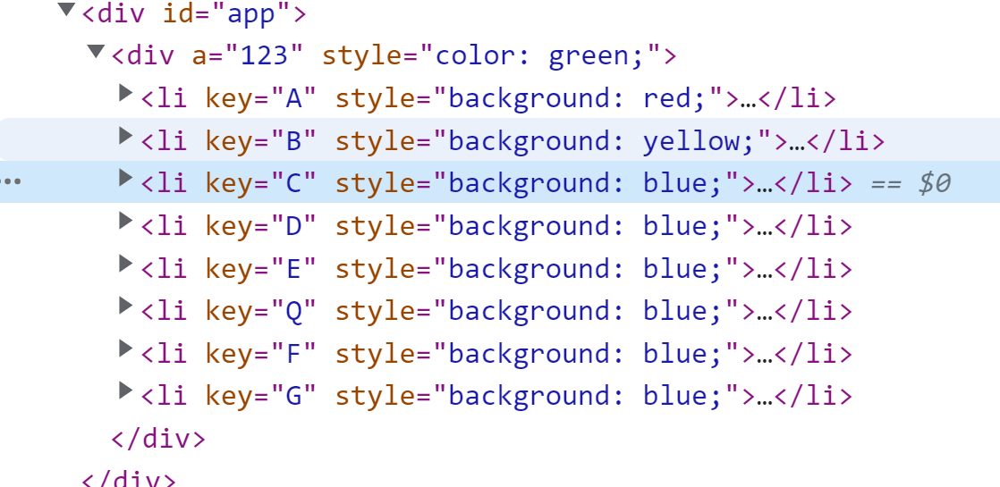
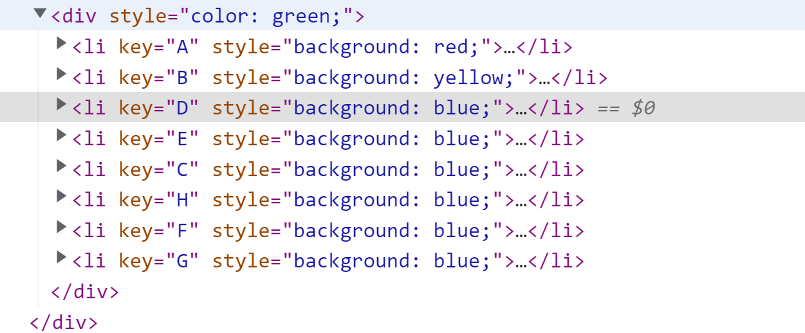

# 最长递增子序列

> 最长递增子序列在vue3源码的diff中有涉及

例如两颗dom树前后的变化：
<div> </div>
<div> </div>

ABCDEFG
ABDECHFG

比较两颗树的过程：首先进行头尾比较缩小范围
 <div>`ab[cde]fg`  S1=2  E1=4</div>
 <div>`ab[dech]fg ` S2=2  e2=5</div>

比较完成之后会将新的树转化成map对象

{"D" => 2,"E" => 3,"C" => 4,"H" => 5}

之后会初始化一个数组为新的树未遍历的长度为4，
然后遍历老的dom树找到他在新数组的下标构建数组`[3,4,2,0]`，如果没找到就为`0`，为了区分复用下标为`0`的情况所以给构建的数组下标加`1`
得到`[4,5,3,0]`,这个时候需要构建新的真实dom树，首先会倒叙遍历新数组`ab[dech]fg` 中的`[dech]`,如果其下标在`[4,5,3,0]`为0的时候就
新增插入到上一个元素之前（insertBefore）。如果存在的就移动到上一个元素之前，这个时候不做优化会进行一次新增3次移动。这个时候如果找到最长递增
序列就可以减少移动的操作，最长序列是`[0,1]`,遇到在最长序列中的元素则不动，所以只需要将`'c'`移动到h的前面即可，这样可以减少2次移动，因为dom操作比较消耗性能，找到最长递增可以减少dom的移动操作。
 


<a href="https://leetcode-cn.com/problems/longest-increasing-subsequence/" target="_blank">题目链接</a>

给你一个整数数组 nums ，找到其中最长严格递增子序列的长度。子序列 是由数组派生而来的序列，删除（或不删除）数组中的元素而不改变其余元素的顺序。
例如，[3,6,2,7] 是数组 [0,3,1,6,2,2,7] 的子序列。


 输入：nums = [10,9,2,5,3,7,101,18]
 <div>输出：4</div>

<div>解释：最长递增子序列是 [2,3,7,101]，因此长度为 4 。</div>


输入：nums = [0,1,0,3,2,3]
输出：4

输入：nums = [7,7,7,7,7,7,7]
输出：1

# 思路
遇到最长最短首先想到的是动态规划，base case为当没有递增序列时为1 ，
状态转移方程为 dp[i] = Math.max(dp[i], dp[j] + 1)

# 动态规划

```js
var lengthOfLIS = function (nums) {

    const dp = new Array(nums.length).fill(1)

    let max = 1

    for (let i = 1; i < nums.length; i++) {

        for (let j = 0; j <i; j++) {

            if (nums[i] > nums[j]) {
                dp[i] = Math.max(dp[i], dp[j] + 1)
            }
        }
        max = Math.max(max, dp[i])
    }
    return max
};

```

# 二分法

```js
var lengthOfLIS = function (nums) {
    const dp = [nums[0]]
    let cur = 0
    for (let i = 0; i < nums.length; i++) {
        if (nums[i] > dp[cur]) {
            dp[++cur] = nums[i]
        } else {
            //二分
            let left = 0, right = cur, pos = 0
            while (left <= right) {
                let mid = left + right >> 1
                if (dp[mid] < nums[i]) {
                    left = mid + 1//找到第一个比他大的元素
                    pos = left

                } else {
                    right = mid - 1
                }
            }
            dp[pos] = nums[i]  //替换第一个比他大的元素的值
        }
    }
    return dp.length
};
```


# 找到最长递增子序列的下标

```js
const getSequence = (arr) => {
    const res = [0]
    const p = arr.slice()
    let start, end
    for (let i = 0; i < arr.length; i++) {
        let resultLastIndex = res[res.length - 1]
        if (arr[i] > arr[resultLastIndex]) {
            p[i] = resultLastIndex
            res.push(i)
            continue
        }
        start = 0
        end = res.length - 1
        while (start < end) {
            const mid = start + end >> 1
            if (arr[i] > arr[res[mid]]) {
                start = mid + 1
            } else {
                end = mid
            }
        }
        if (arr[i] < arr[res[start]]) {
            if (start > 0) {
                p[i] = res[start - 1]
            }
            res[start] = i
        }
    }
    let len1 = res.length
    let last = res[len1 - 1]
    while (len1--) {
        res[len1] = last
        last = p[last]
    }
    return res
}
```