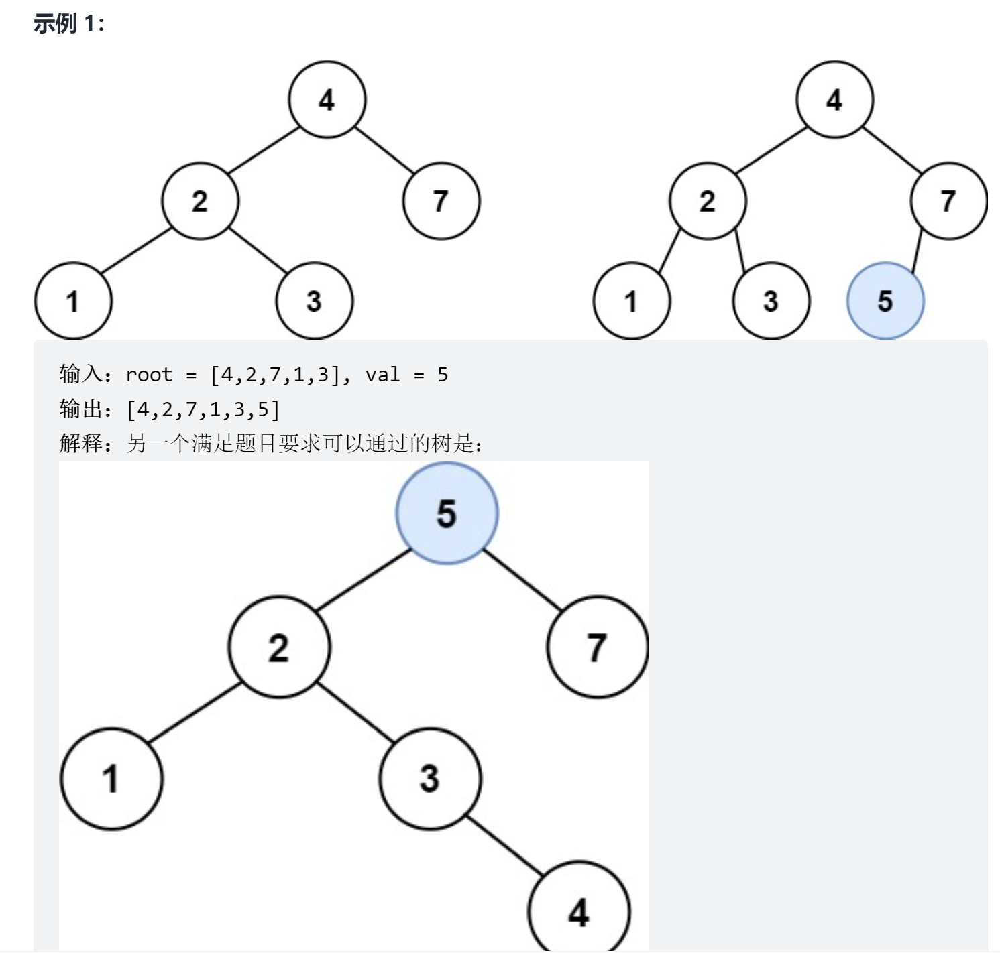

# 二叉搜索树中的插入操作
<a href="https://leetcode-cn.com/problems/insert-into-a-binary-search-tree/" target="_blank">题目链接</a>

```
给定二叉搜索树（BST）的根节点 root 和要插入树中的值 value ，将值插入二叉搜索树。 
返回插入后二叉搜索树的根节点。 输入数据 保证 ，新值和原始二叉搜索树中的任意节点值都不同。

注意，可能存在多种有效的插入方式，只要树在插入后仍保持为二叉搜索树即可。你可以返回 任意有效的结果 。
```

<div> </div>

> 利用搜索树的特性，比他大的值插入到右边，比他小插入到左边


```js
var insertIntoBST = function (root, val) {
    if (root === null) return new TreeNode(val)


    if (root.val > val) {
        root.left = insertIntoBST(root.left, val)
    } else if (root.val < val) {
        root.right = insertIntoBST(root.right, val)
    }

    return root
};
```