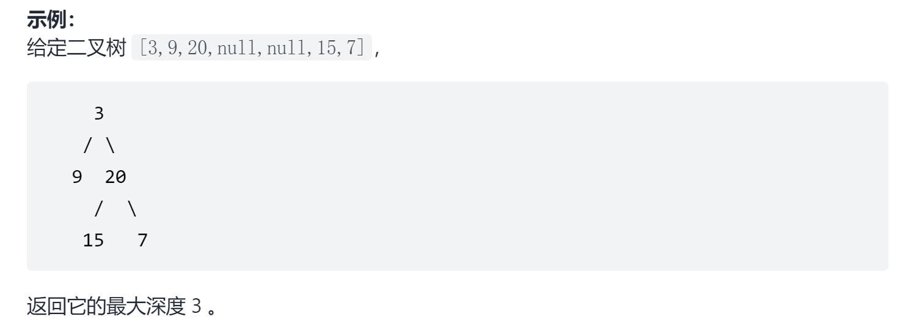

# 二叉树的最大深度
<a href="https://leetcode-cn.com/problems/maximum-depth-of-binary-tree/" target="_blank">题目链接</a>

```
给定一个二叉树，找出其最大深度。

二叉树的深度为根节点到最远叶子节点的最长路径上的节点数。

说明: 叶子节点是指没有子节点的节点。
```
<div> </div>

> 可以用递归或者迭代来做，迭代要注意入栈和出栈的顺序

- 迭代

```js
var maxDepth = function (root) {
    if (!root) return 0
    const q = []
    q.push(root)
    let count = 0
    while (q.length) {
        const len = q.length
        for (let i = 0; i < len; i++) {
            const n = q.shift()//因为后进先出所以必须使用shift不然会把刚插入下一层的数据取出来
            if (n.left) q.push(n.left)
            if (n.right) q.push(n.right)
        }
        count++
    }

    return count
};

```

