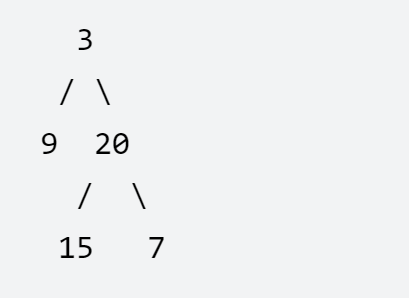

# 从中序与后序遍历序列构造二叉树
<a href="https://leetcode-cn.com/problems/construct-binary-tree-from-inorder-and-postorder-traversal/" target="_blank">题目链接</a>

```
根据一棵树的中序遍历与后序遍历构造二叉树。

注意:
你可以假设树中没有重复的元素。
例如：
中序遍历 inorder = [9,3,15,20,7]
后序遍历 postorder = [9,15,7,20,3]
你可以返回
```
<div> </div>
> 不断的利用后序遍历最后一个节点确定根节点，中序左右子树用根节点分开递归的去写


```js
var buildTree = function (inorder, postorder) {
    if (!inorder.length) return null
    //后序遍历确定其根节点
    const rootVal = postorder.pop()
    let rootNode = new TreeNode(rootVal)
    //找到根节点在中序遍历的位置
    const rootIndex = inorder.indexOf(rootVal);
    //中序的左子树
    const Inleft = inorder.slice(0, rootIndex);
    //后序的左子树
    const poleft = postorder.slice(0, Inleft.length)

    rootNode.left = buildTree(Inleft, poleft)
    //中序的右子树
    const Inright = inorder.slice(rootIndex + 1);
    //后序的右子树
    const poright = postorder.slice(Inleft.length)

    rootNode.right = buildTree(Inright, poright)
    return rootNode
};
```