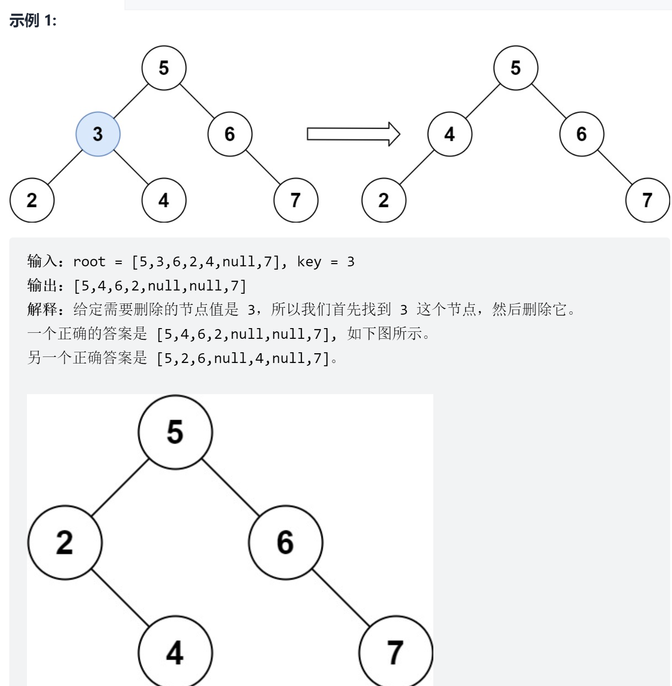

# 删除二叉搜索树中的节点
<a href="https://leetcode-cn.com/problems/delete-node-in-a-bst/" target="_blank">题目链接</a>

```
给定一个二叉搜索树的根节点 root 和一个值 key，删除二叉搜索树中的 key 对应的节点
，并保证二叉搜索树的性质不变。返回二叉搜索树（有可能被更新）的根节点的引用。

一般来说，删除节点可分为两个步骤：

首先找到需要删除的节点；
如果找到了，删除它。


```

<div> </div>

> 中序遍历刚好满足题目的要求，为递增的树,3种情况，值为key的节点左右子树为空，返回另外一颗即为删除，如果都不为空，将左子树挂载到
> 右子树的最左边，返回右子树


```js
var deleteNode = function (root, key) {
    if (!root) return null
    if (root.val > key) {
        root.left = deleteNode(root.left, key)
    } else if (root.val < key) {
        root.right = deleteNode(root.right, key)
    } else {
        if (!root.left)return root.right
        if (!root.right)return root.left
        if (!root.left && !root.right) return null

        let cur = root.right

        while (cur.left) cur = cur.left
        cur.left = root.left
        return root.right
    }


    return root

};
```