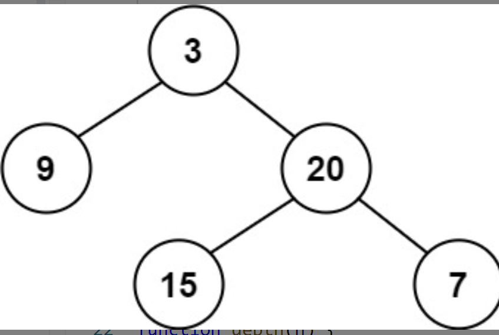

# 平衡二叉树
<a href="https://leetcode-cn.com/problems/balanced-binary-tree/" target="_blank">题目链接</a>

```
给定一个二叉树，判断它是否是高度平衡的二叉树。
就是左右子树的高度不超过1
```
<div> </div>

> 平衡二叉树就是两个左右节点的高度不超过1，遍历其所有节点的高度。判断是否超过1


```js
var isBalanced = function (root) {
    if (!root) return true
    const left = root.left ? depth(root.left) : 0
    const right = root.right ? depth(root.right) : 0
    return Math.abs(left - right) <= 1 && isBalanced(root.left)
     &&  isBalanced(root.right)
};
function depth(n) {
    if (!n) return 0
    return 1 + Math.max(depth(n.left), depth(n.right))
}

```