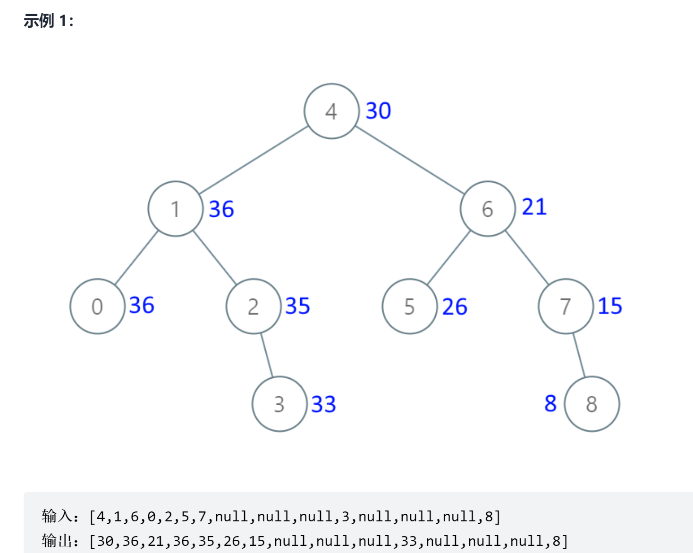

# 把二叉搜索树转换为累加树
<a href="https://leetcode-cn.com/problems/convert-bst-to-greater-tree/" target="_blank">题目链接</a>

```
给出二叉 搜索 树的根节点，该树的节点值各不相同，请你将其转换为累加树（Greater Sum Tree），
使每个节点 node 的新值等于原树中大于或等于 node.val 的值之和。

提醒一下，二叉搜索树满足下列约束条件：

节点的左子树仅包含键 小于 节点键的节点。
节点的右子树仅包含键 大于 节点键的节点。
左右子树也必须是二叉搜索树。

```
<div> </div>

> 记录累加值，用反后序遍历修改每个节点的值


```js
var convertBST = function (root) {
    let pre = 0

    const dfs = (n) => {
        if (!n) return null
        dfs(n.right)
        n.val = n.val + pre
        pre = n.val
        dfs(n.left)
    }

    dfs(root)
    return root

};
```