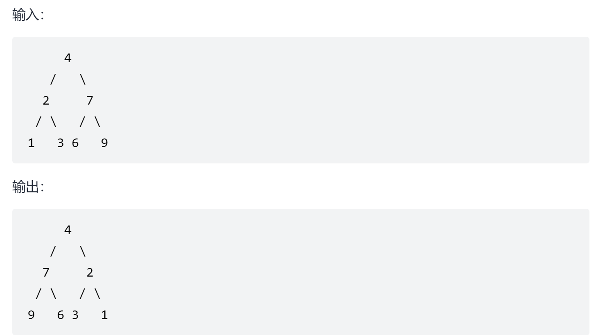

# 翻转二叉树
<a href="https://leetcode-cn.com/problems/invert-binary-tree/" target="_blank">题目链接</a>

```
翻转一棵二叉树。

输入：root = [3,9,20,null,null,15,7]
输出：[[3],[9,20],[15,7]]
```
<div> </div>

> 可以用递归或者迭代来做，迭代要注意入栈和出栈的顺序

- 迭代

```js
var invertTree = function (root) {
    if (!root) return root

    const q = [];
    q.push(root);

    while (q.length) {
        let n = q.shift();
        [n.left, n.right] = [n.right, n.left];
        if (n.left) q.push(n.left);
        if (n.right) q.push(n.right);
    }
    return root
};

```

- 递归

```js
var invertTree = function (root) {
    if (!root) return root;
    invertTree(root.left);
    invertTree(root.right);
    [root.left, root.right] = [root.right, root.left];
    return root
};

```
