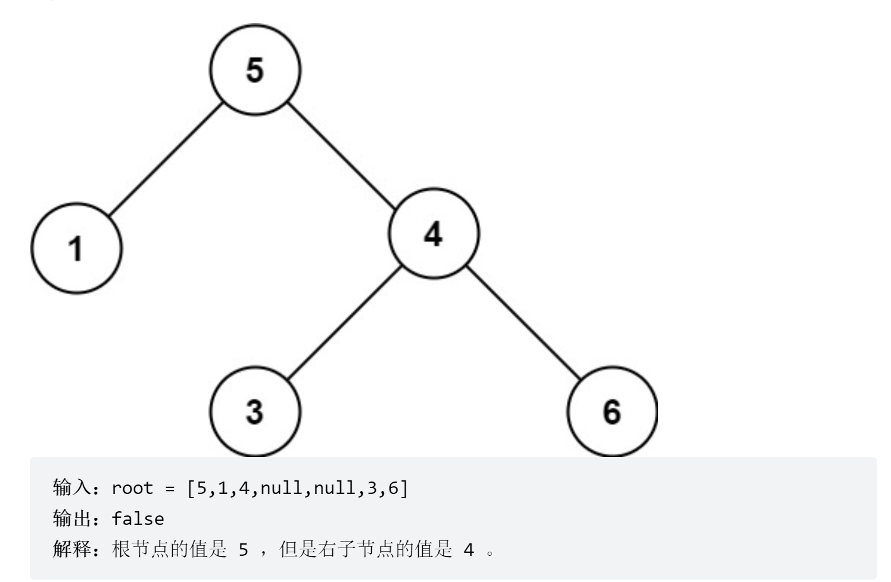

# 验证二叉搜索树
<a href="https://leetcode-cn.com/problems/validate-binary-search-tree/" target="_blank">题目链接</a>

```
给你一个二叉树的根节点 root ，判断其是否是一个有效的二叉搜索树。

有效 二叉搜索树定义如下：

节点的左子树只包含 小于 当前节点的数。
节点的右子树只包含 大于 当前节点的数。
所有左子树和右子树自身必须也是二叉搜索树。

```

<div> </div>

> 中序遍历刚好满足题目的要求，为递增的树


```js
var isValidBST = function (root) {
    //由题可得出该树如果用中序遍历是一颗递增的树
    const result = []
    const inorder = (n) => {
        if (!n) return
        inorder(n.left)
        result.push(n.val)
        inorder(n.right)

    }
    inorder(root)
    for (let i = 1; i < result.length; i++) {
        if (result[i] <= result[i - 1]) return false
    }
    return true
};
```